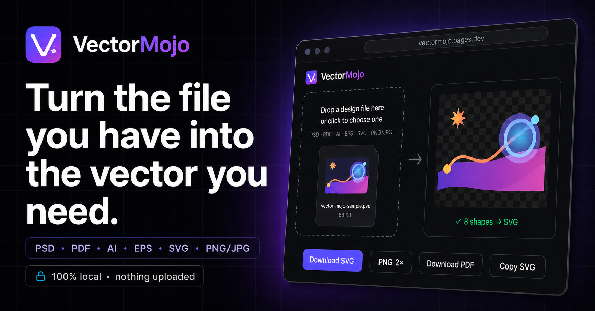
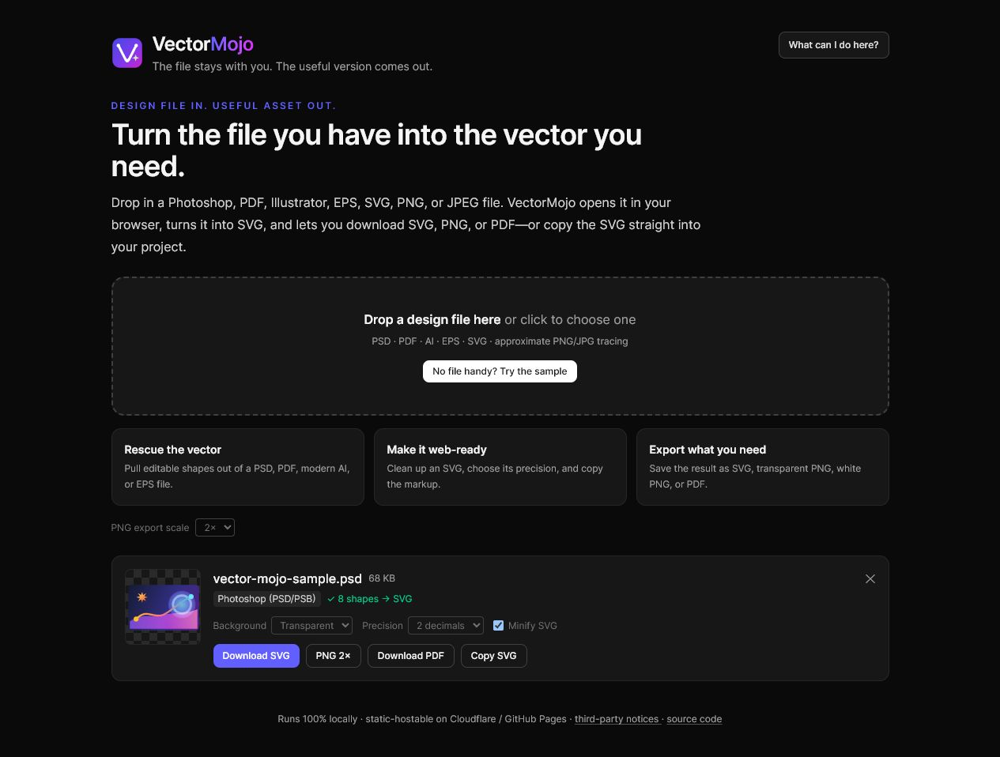
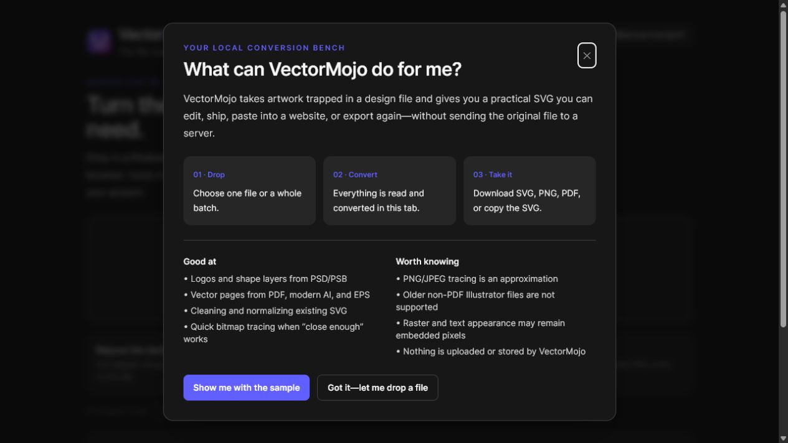

<div align="center">

<a href="https://vectormojo.lunarwerx.com">
  
</a>

<p>
  <a href="https://vectormojo.lunarwerx.com"><b>Open VectorMojo</b></a>
  &nbsp;·&nbsp; <a href="#what-it-does">What it does</a>
  &nbsp;·&nbsp; <a href="#what-goes-in">Formats</a>
  &nbsp;·&nbsp; <a href="#run-it-yourself">Run locally</a>
</p>

<p>
  <a href="https://vectormojo.lunarwerx.com"></a>
  <a href="https://github.com/LunarWerxs/vectormojo/actions/workflows/ci.yml"></a>
  
  <a href="LICENSE"></a>
</p>

</div>

---

Most of the time, you do not need Photoshop. You need the logo trapped inside
the PSD. Or a clean SVG from a PDF somebody sent three years ago. Or a PNG you
can turn into *something* editable before lunch.

**VectorMojo is the escape hatch.** Drop in the awkward design file, let the
browser pull out what it can, then take the result as SVG, PNG, PDF, or copied
markup. The first 10 conversions work as a guest; a free Connections account
unlocks unlimited conversions. There is no upload step and no server holding on
to the original.

<p align="center">
  
</p>

## What it does

- **Rescues vector artwork.** Pulls shape layers and paths out of PSD/PSB, PDF,
  modern Illustrator, and EPS files.
- **Makes SVGs easier to ship.** Opens, sanitizes, normalizes, rounds, prettifies,
  or minifies the SVG you already have.
- **Traces the bitmap when that is the only option.** PNG and JPEG tracing is
  approximate, but it is often enough for a draft, icon, or starting point.
- **Exports the useful version.** Download SVG, transparent or white-background
  PNG at exact pixel dimensions, and PDF—or copy the SVG straight into a
  project.
- **Handles the small annoying details.** Multi-page PDFs, background choice,
  export precision, batch drops, masks, patterns, gradients, and transparent
  previews are already accounted for.

## Try it

Open **[vectormojo.lunarwerx.com](https://vectormojo.lunarwerx.com)** and drop a file.
That is the whole setup.

No suitable file nearby? Click **No file handy? Try the sample**. VectorMojo
ships with a small, neutral PSD so you can see the complete conversion and
export flow without handing it any of your own artwork.

The **What can I do here?** button explains the workflow, the good fits, and the
places where conversion is necessarily approximate:

<p align="center">
  
</p>

## What goes in

| Input | What VectorMojo does |
| --- | --- |
| **PSD / PSB** | Keeps shape layers as vectors; preserves raster, text, and smart-object appearance as embedded pixels when needed |
| **PDF** | Turns each selected page into real SVG geometry |
| **Illustrator `.ai`** | Opens modern PDF-compatible AI files; older non-PDF AI files are not supported |
| **EPS / PostScript** | Converts through local Ghostscript and MuPDF WebAssembly |
| **SVG** | Removes executable content and cleans, normalizes, rounds, or minifies the markup |
| **PNG / JPEG** | Runs a local approximate color trace into SVG paths |

Everything lands in SVG first. From there, VectorMojo can export **SVG, PNG,
PDF, or clipboard-ready SVG markup**.

## Private by architecture

There is no VectorMojo backend. File reading, parsing, tracing, rendering, and
export all happen in the current browser tab with JavaScript and WebAssembly.
Closing the tab closes the workbench; VectorMojo does not upload or store the
files you give it.

The production build is a collection of static files, which is why it can live
on Cloudflare Pages without a database, upload bucket, or processing server.
Connections supplies optional account authentication through its public,
PKCE-only browser SDK; only the sign-in session leaves the tab. The artwork
never does. The quota and authentication decisions are documented in
[`docs/CONNECTIONS.md`](docs/CONNECTIONS.md).

## A realistic note about fidelity

Design formats are messy. A Photoshop file can mix true paths, pixels, fonts,
smart objects, masks, patterns, and blend modes in the same layer stack.
VectorMojo keeps vector geometry vector where the source exposes it, and embeds
stored pixels where that is the honest way to preserve the appearance.

That means a PSD can produce a very useful SVG without every object becoming a
perfectly editable Bézier path. PNG/JPEG tracing is even more explicitly an
approximation. The app shows warnings instead of pretending otherwise.

The deeper implementation notes live in
[`docs/PSD_FIDELITY.md`](docs/PSD_FIDELITY.md).

## Run it yourself

You need [Bun](https://bun.sh).

```sh
git clone https://github.com/LunarWerxs/vectormojo.git
cd vectormojo
bun install
bun run dev
```

The useful checks:

```sh
bun test          # conversion + pixel-diff regression suite
bun run build     # audited production bundle in dist/
bun run preview   # serve that bundle locally
```

The production build refuses to continue if anything other than the reviewed
neutral PSD appears in `public/samples/`, even when that file is ignored by Git.
Private scratch artwork belongs in the ignored `local-samples/` directory.

## Built with

**Bun** · **Vue 3** · **Vite** · **Tailwind CSS 4** · **Connections** ·
**ag-psd** · **MuPDF.js** · **Ghostscript WASM** · **SVGO** ·
**ImageTracer.js** · **jsPDF**

The converter registry is in [`src/lib/registry.ts`](src/lib/registry.ts);
each format lazy-loads its own engine, so opening the page does not immediately
pull down the large PDF or EPS runtimes.

## License

VectorMojo's original source is [MIT](LICENSE) © VectorMojo contributors. Do
what you want with it.

The browser bundle also includes MuPDF.js and Ghostscript WASM under the AGPL.
Those components keep their own licenses; public builds include their full
license texts and a corresponding-source pointer. See
[`public/THIRD_PARTY_NOTICES.txt`](public/THIRD_PARTY_NOTICES.txt).

<div align="center">
  <br />
  <a href="https://vectormojo.lunarwerx.com"></a>
  <br /><br />
  <sub>Built by <a href="https://lunarwerx.com"><b>LunarWerxs</b></a> · Deployed on Cloudflare Pages</sub>
</div>
